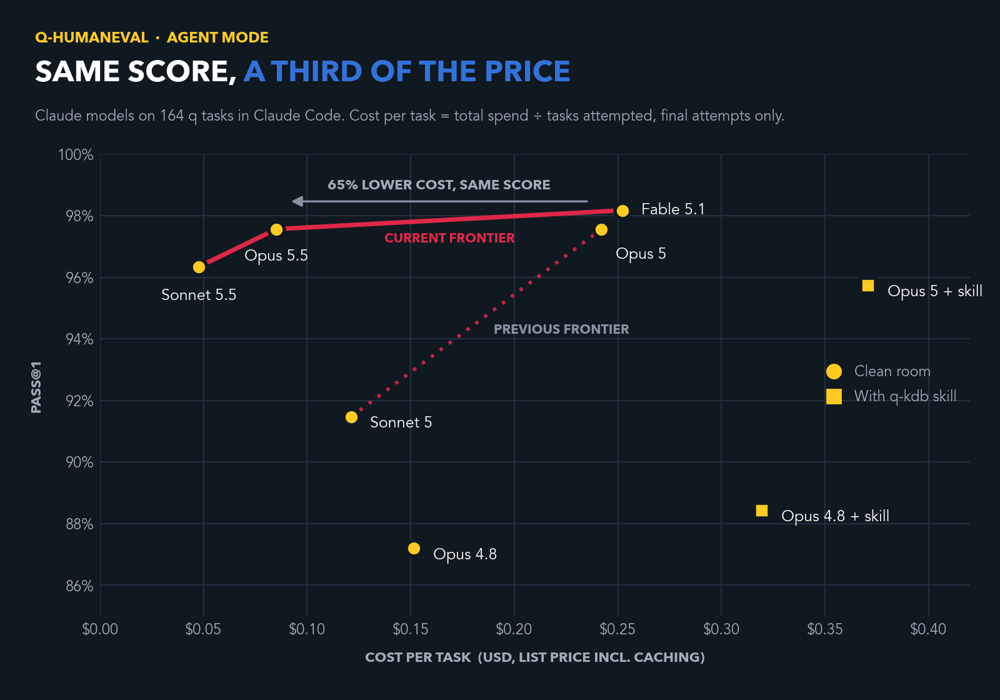

# Same score, a third of the price: cost per task on q-humaneval

*October 1, 2026*

The q-humaneval agent leaderboard has a new column: cost per task. It shows something the pass rates no longer can. With the 5.5 releases, the best results on this benchmark got dramatically cheaper. Claude Opus 5.5 matches Opus 5's score at about a third of the cost, and Sonnet 5.5 beats Sonnet 5 while costing 60% less. This post explains the new metric and what it shows.

## Why look at cost now

When we started running coding agents against q-humaneval, the interesting question was whether they could write working q at all. That question has been answered. Claude Fable 5.1 solves 161 of the 164 problems, Opus 5.5 and Opus 5 both solve 160, and Sonnet 5.5 solves 158. Four models within three problems of each other, all near the ceiling, means the pass rate no longer separates them. For practical purposes the benchmark is saturated at the top.

What still separates them is what they cost to get there, and that turns out to vary a lot.

The idea comes from Databricks. In [Benchmarking Coding Agents on Databricks' Multi-Million Line Codebase](https://www.databricks.com/blog/benchmarking-coding-agents-databricks-multi-million-line-codebase), their team measured coding agents on real engineering work and reported cost per task alongside quality. Their central point applies directly here: a model's price per token is a poor guide to what it costs to finish a job, because models differ widely in how much work they do along the way. We adopted the same measure so our numbers can be read the same way.

## The frontier moved left

The chart follows the Databricks layout: cost per task across the bottom (total spend divided by tasks attempted, explained below), pass rate up the side, and a red line marking the Pareto frontier, the models for which nothing else is both cheaper and better. Three models sit on it today: Sonnet 5.5, Opus 5.5 and Fable 5.1. Every other model is matched or beaten on score by one of them, at a lower cost.

The dotted line is the frontier as it stood before the 5.5 releases, when Sonnet 5 and Opus 5 were the best options. Both ends of it moved. Opus kept its score and cut its cost per task by 65%: the same 97.6% that cost $0.242 with Opus 5 costs $0.085 with Opus 5.5. Sonnet moved up and to the left at once, gaining almost five points while its cost per task fell 60%, from $0.121 to $0.048.

| Model | Pass@1 | Cost per task |
|---|---|---|
| Claude Fable 5.1 | 98.2% | $0.252 |
| Claude Opus 5.5 | 97.6% | $0.085 |
| Claude Opus 5 | 97.6% | $0.242 |
| Claude Sonnet 5.5 | 96.3% | $0.048 |
| Claude Sonnet 5 | 91.5% | $0.121 |
| Claude Opus 4.8 | 87.2% | $0.152 |

*Clean-room runs, no skills installed.*

Fable 5.1, Anthropic's most capable widely released model, is on the frontier only because it has the single highest score. It solved one more problem than Opus 5.5, 161 instead of 160, at about three times the cost per task. On a benchmark this close to saturated there is very little left to win, so the extra capability has almost nothing to show for itself here. This is where cost per task earns its place. When scores converge, paying for the most capable model only makes sense if the work actually needs it.

The comparison with older models is starker still. Against Opus 4.8, Anthropic's flagship as recently as June, Sonnet 5.5 is nine points better and costs less than a third as much per task.

Token prices explain very little of this. Sonnet 5 and Sonnet 5.5 are priced identically per token, yet the newer model's cost per task fell by 60%. Opus 5.5's per-token price is 20% below Opus 5's, but its cost per task fell by 65%. The savings come from how the models work. They take far fewer steps: Opus 5.5 averages under two tool calls per task where Opus 5 averaged between six and seven, often writing a solution and testing it in one go. They also write much less along the way, between half and two thirds less output than their predecessors. On a median task, Opus 5.5 finishes in about 9 seconds. Opus 5 took about 33.

Some of the change could have come from the harness, the agent software that drives the model, because Claude Code was also updated between our July runs and these. To separate the two, we re-ran Opus 5 on the current version of Claude Code. The newer harness is more economical with tools: Opus 5 made about a third fewer tool calls and took about a third fewer turns, and it solved the same 160 of 164 problems. But it wrote just as much, and output is where most of the cost is, so its cost per task fell only about 3%, from $0.242 to $0.234. Nearly all of the drop to Opus 5.5's $0.085 came with the new model.

There is one harness feature we can't separate out. Claude Code now adjusts how much reasoning effort the 5.5 models spend on each turn, and it doesn't do this for Opus 5 or Sonnet 5. The model numbers include that behavior.

The harness can still matter a great deal. Databricks found that the same model could cost more than twice as much per task depending on which harness ran it. A version update to the same harness made little difference here, but our numbers describe each model as it runs in Claude Code today, not the model in isolation.

## How we calculate it

Cost per task is the total spend for a run divided by the number of tasks attempted, which is 164 for every run on the board. Failed tasks count toward the spend, so a model that burns money and still gets the answer wrong pays for it.

The dollar figures are what the work would cost at Anthropic's published API prices, including the discount for cached prompt input. We ran everything on a subscription, so our actual cash outlay was close to zero, but list price is the fair basis for comparison. Where a harness problem forced us to re-run a task, only the final attempt counts.

## The skills have become a cost

Our evaluation harness can install a q skill into each agent's workspace: a reference guide to q syntax, common errors and idioms that the agent reads before it starts. When we introduced it, it helped. That is no longer true for the leading Claude models.

On Opus 5, the skill raised cost per task by 53%, from $0.242 to $0.371, and the score went down slightly, from 97.6% to 95.7%. That difference in score is small enough to be noise, but there is no sign of a benefit, and in no case did the skill rescue a task the model could not solve without it. The extra cost is real and comes from the agent spending turns and tokens reading material it does not need. Opus 4.8 shows the same pattern in milder form: the skill added about one point and doubled the cost per task.

We did not run the skill against Opus 5.5 or Sonnet 5.5. Without it they solve 160 and 158 of 164 problems, which leaves almost nothing for a skill to fix, and the Opus 5 result tells us what it would add to the bill. For these models the skill is overhead, and the clean-room configuration is both the cheapest and the best way to run them.

That conclusion is specific to frontier Claude models. GPT-5.5 still gained six points from the skill, and older or smaller models may benefit as well.

## What comes next

We fully expect the frontier to keep moving left. Writing q code with an agent will keep getting both better and cheaper, and cost per task lets us measure how quickly that happens.

So far this is a Claude-only picture. We will add cost per task for OpenAI models, starting with GPT-5.5, which is already on the leaderboard, and benchmark newer OpenAI models as they arrive. We also want to try models that could be cheaper still. Databricks found the open-weight GLM 5.2 on par with Opus 4.8 at about two thirds of the cost per task, and models like it have not yet been tested on q.

Finally, with the best models near the ceiling, q-humaneval has done its job. The next step is a harder q benchmark, and we are working out what it should test.

The full results, including the configuration details for every run, are on the [leaderboard](../leaderboard.md).
